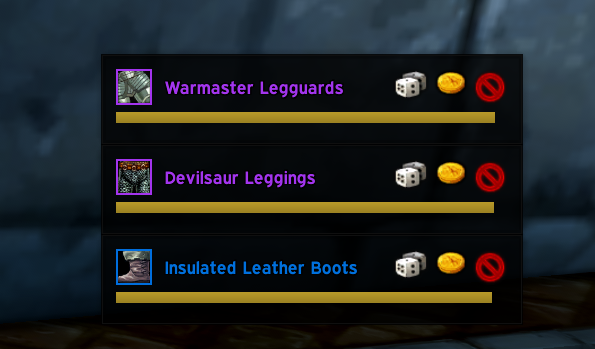
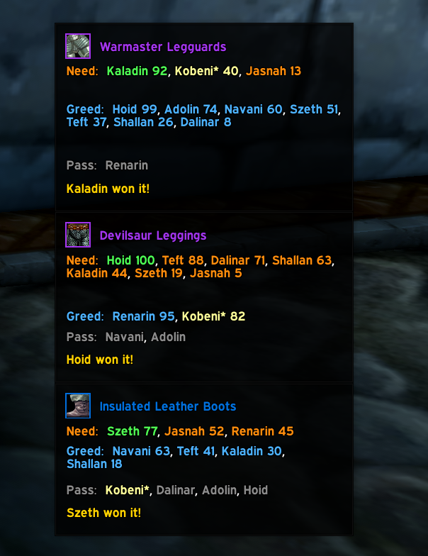
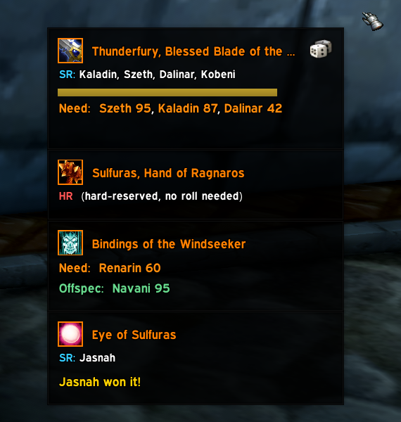

# CleanRolls

A floating window that tracks group loot rolls in real time, for vanilla WoW 1.12 (Turtle-based servers) - so you don't have to read them out of chat. Shows who's rolling what, updates live as people click, flashes the winner, and fades out on its own once it's resolved. Works with the standard Need/Greed/Pass loot system out of the box, and also understands [RollFor](https://github.com/sica42/RollFor) soft-reserves if your raid uses it.

## Install

1. Copy the `CleanRolls` folder into `Interface/AddOns/`
2. Enable CleanRolls at the character select addon list

If **pfUI** is also installed, the window automatically matches its look - no configuration needed.

## Usage

Nothing to turn on - it starts watching the moment you log in. A small **Loot Rolls** title bar shows up on the right side of your screen; drag it anywhere.

- `/cleanrolls` or `/cr` - full command list
- `/cr lock` - hide the title bar to save space once you've got it positioned; `/cr unlock` brings it back
- `/cr reset` - reset window position
- `/cr test` - preview the window with fake rolls (no real loot needed)
- `/cr rftest` / `/cr rfbtest` - same, for the RollFor integration specifically
- `/cr debug` - off by default; logs exactly what chat text/RollFor broadcasts arrive and how they're parsed to `CleanRolls_debug.log` (in the client's `CustomData` folder, requires Nampower v3.2+) instead of spamming chat, for troubleshooting after a raid rather than during one

## How it works

A panel pops up the moment an item starts being rolled on, with the item's icon and name up top. As people click Need/Greed/Pass, their name appears immediately - even before the roll number is revealed, which this server only broadcasts in a batch right before the winner is announced. Rolls are grouped by type rather than listed one row per person, so a raid full of Greed rolls reads as one line instead of twenty.

- **Replaces the stock loot roll popup entirely** - CleanRolls suppresses the default (or pfUI-reskinned) Need/Greed/Pass popup and shows its own buttons right on the panel instead, so there's nothing else to find or tab over to. Buttons stay put through a Bind-on-Pickup confirmation ("Looting this item will bind to you") instead of vanishing before you've answered it.
- **A real countdown**, while you still have a decision to make - your actual roll timer if it's your own eligible roll, otherwise an honest "no timer available" readout if you're only watching someone else's roll play out.
- **The winner's row flashes gold, then eases into green** and stays there, so you don't have to go hunting for the "X won it!" line.
- Every outcome resolves and fades on its own: someone wins, everyone passes, nobody rolls at all, or the roll times out - each one clears the panel after a few seconds instead of leaving it stuck open.

## RollFor support

If your raid uses [RollFor](https://github.com/sica42/RollFor) for soft-reserves, items get an **SR:** or **HR** badge listing who reserved what, straight from the drop announcement. Rolls are split into **Need / Offspec / Transmog**, based on the actual roll range people use (`/roll 100` / `99` / `98` by convention) rather than the roll value itself - so a lower Need roll still correctly beats a higher Offspec one. If you're one of the people who soft-reserved a contested item, you get a Need button right there too.

This works two ways, and doesn't require RollFor to be installed for you to see it, or changed in any way for CleanRolls to work with it:

1. **Chat text** - the item announcements, roll results, and winner lines RollFor posts to raid/party chat, the same ones everyone already sees.
2. **RollFor's own sync broadcast** - RollFor quietly syncs its live roll state to every RollFor-running player over the addon message channel, not just the raid leader. CleanRolls listens in on that too (purely passively - it's the same public broadcast every other RollFor client already reads), and prefers it when available since it carries the *exact* configured roll thresholds and a precise "this roll just opened" signal that chat text alone can't provide. Chat-text parsing keeps running either way, as a fallback for anyone who joined mid-raid.

## Known limitations

- Chat-text parsing is exactly that - if a server or RollFor update changes its wording, a pattern can silently stop matching. Nothing breaks, it just stops picking that one thing up.
- When more than one un-rolled item is open at once, an individual `/roll` is attributed to whichever item's reserve list contains that person's name; failing that, to the oldest still-open item with no reserve list at all. This is usually exactly right, but it's a best guess from chat text, not authoritative state, for anyone not using RollFor's addon-comm sync.
- If the exact same item drops more than once at once, each drop gets its own independent roll (its own buttons, its own timer, its own winner) - that part is authoritative, tied to the real roll ID the game gives each one. But *whose name goes on which copy's roll list* is still a best guess from chat text, same as above, since a chat line like "X rolled Greed for [Item]" doesn't say which of the two simultaneous rolls it belongs to. pfUI's own chat-derived roll display has this identical limitation, for the identical reason.
- If some other addon also overrides the stock loot roll popup (the same thing pfUI's roll module does), whichever one loads last wins and the other's override silently doesn't apply. Not unique to CleanRolls - any addon doing this kind of override carries the same tradeoff.

## Credits

Built to match the look of [CombatLedger](https://github.com/kobeniiiiii/CombatLedger) and [LootLedger](https://github.com/kobeniiiiii/LootLedger) - the Expressway font, flat backdrop skin, and pfUI-aware styling are bundled from [pfUI](https://github.com/shagu/pfUI) by Eric Mauser (Shagu), MIT-licensed.
